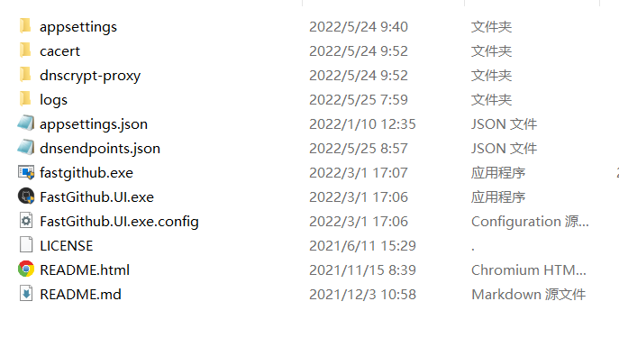

# 这是一个用vscode配合mkdown的演示文件
1. 先安装vscode和vscode mddown的插件

可以用两种方式来进行push

2. 用git命令行

ctrl+shift+p then past image

ctrl+alt+v

3. 用vscode的图形界面
   
    首先，点击源代码管理项目窗口，点击对应文件的暂存更改。对应的是命令行的git add 命令

    其次，点击提交，输入相应的信息，对应的是命令行的，git commit -m 命令

    最后，点击右上角的3个省略号，选择推送。对应的是命令行的，git push 指定网址 指定文件

